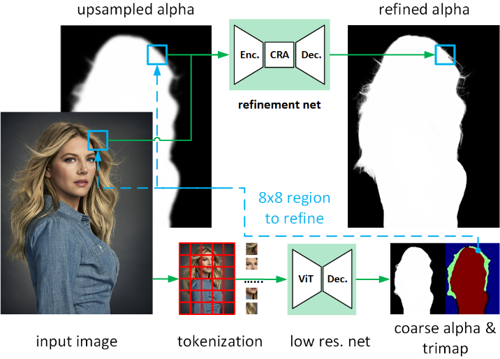

## LiPM - WIP
Implementation of [Lightweight Portrait Matting via Regional Attention and Refinement](https://arxiv.org/abs/2311.03770).

## Citations

```bibtex
@misc{zhong2023lightweight,
    title={Lightweight Portrait Matting via Regional Attention and Refinement}, 
    author={Yatao Zhong and Ilya Zharkov},
    year={2023},
    eprint={2311.03770},
    archivePrefix={arXiv},
    primaryClass={cs.CV}
}
@inproceedings{liu2021swinv2,
    title={Swin Transformer V2: Scaling Up Capacity and Resolution}, 
    author={Ze Liu and Han Hu and Yutong Lin and Zhuliang Yao and Zhenda Xie and Yixuan Wei and Jia Ning and Yue Cao and Zheng Zhang and Li Dong and Furu Wei and Baining Guo},
    booktitle={International Conference on Computer Vision and Pattern Recognition (CVPR)},
    year={2022}
}
@inproceedings{liu2021Swin,
    title={Swin Transformer: Hierarchical Vision Transformer using Shifted Windows},
    author={Liu, Ze and Lin, Yutong and Cao, Yue and Hu, Han and Wei, Yixuan and Zhang, Zheng and Lin, Stephen and Guo, Baining},
    booktitle={Proceedings of the IEEE/CVF International Conference on Computer Vision (ICCV)},
    year={2021}
}
@misc{rw2019timm,
    title={PyTorch Image Models},
    author={Ross Wightman},
    year={2019},
    publisher={GitHub},
    journal={GitHub repository},
    doi={10.5281/zenodo.4414861},
    howpublished = {\url{https://github.com/rwightman/pytorch-image-models}}
}
```
